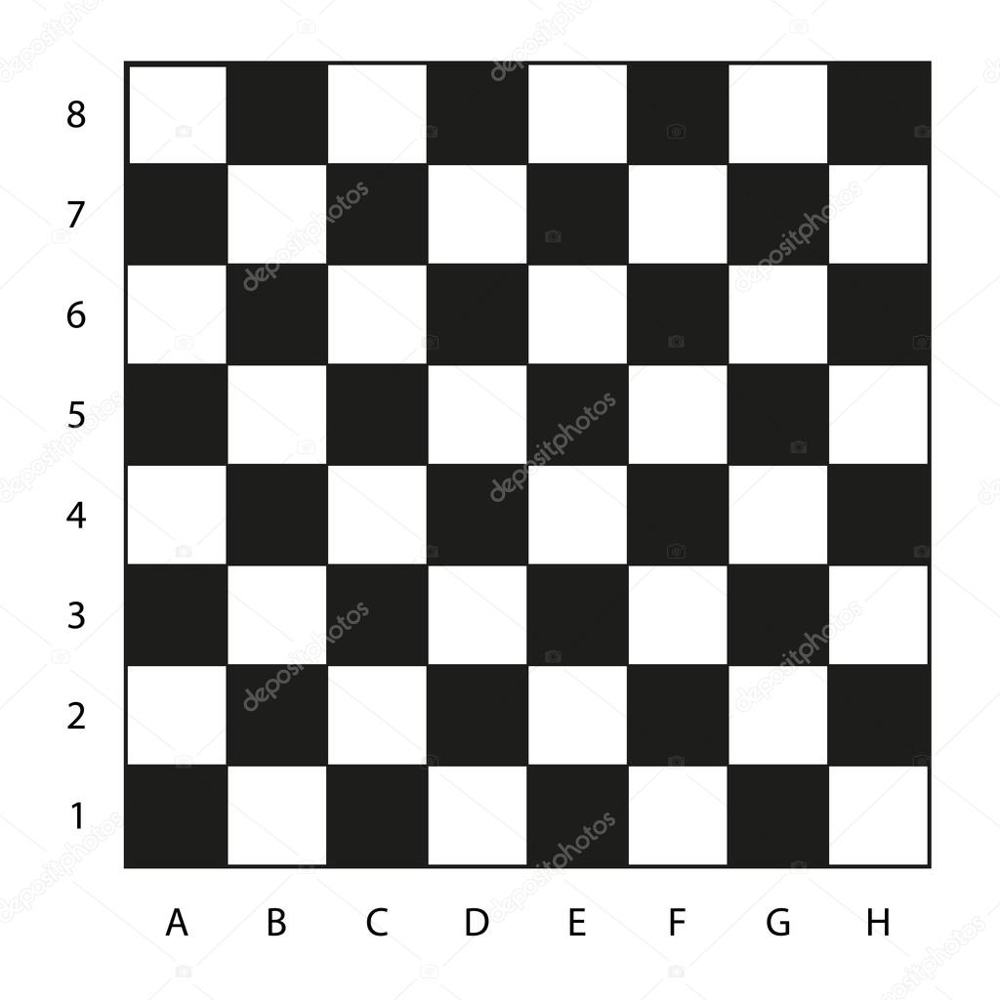

# Testes do Sistema de Movimentação de Peças - MateCheck



## Índice
- 1. Teste de Funcionamento Básico
  - 1.1 Cenário: Movimentação Padrão
    - Nível Básico
    - Nível Aventureiro
    - Nível Mestre (Recursividade e Loops)
- 2. Teste de Entradas Inválidas
- 3. Teste com Valores Extremos
- 4. Guia de Execução de Testes

---
# 1. Teste de Funcionamento Básico

## 1.1 Cenário: Movimentação Padrão

### Nível Novato

**Entradas:**
```
3 [Enter]
4 [Enter]
3 [Enter]
2 [Enter]
```

**Saída Esperada:**
```
=== SISTEMA DE TESTE DE MOVIMENTACAO - MATECHECK ===

Digite o numero de casas para cada peça:
Bispo (movimento diagonal): 5
Torre (movimento horizontal): 5
Rainha (movimento horizontal): 8
Cavalo (quantidade de movimentos em L): 2

TESTE DO BISPO:
Movimento diagonal superior direita (5 casas):
Casa 1: Cima + Direita
[... até casa 5 ...]

TESTE DA TORRE:
Movimento para direita (5 casas):
Casa 1: Direita
[... até casa 5 ...]

TESTE DA RAINHA:
Movimento para esquerda (8 casas):
Casa 1: Esquerda
[... até casa 8 ...]

TESTE DO CAVALO:
Movimento em L (2 casas):
Movimento 1: Baixo + Baixo + Esquerda
Movimento 2: Baixo + Baixo + Esquerda
```

---

### Nível Aventureiro

**Entradas:**
```
3 [Enter] (apenas para o Cavalo)
```

**Saída Esperada:**
```
TESTE DO CAVALO:
Movimento em L (3 casas):
Movimento 1: Baixo + Baixo + Esquerda
Movimento 2: Baixo + Baixo + Esquerda
Movimento 3: Baixo + Baixo + Esquerda
```

---

### Nível Mestre (Recursividade e Loops)

**Entradas:**
```
3 [Enter]
4 [Enter]
5 [Enter]
2 [Enter]
```

**Saída Esperada:**
```
=== SISTEMA AVANCADO DE MOVIMENTACAO - MATECHECK (NIVEL MESTRE) ===

Digite o numero de casas para cada peça:
Bispo (movimento diagonal): 3
Torre (movimento horizontal): 4
Rainha (movimento horizontal): 3
Cavalo (quantidade de movimentos em L): 2

BISPO (RECURSIVO - Diagonal a partir de B2):
B2: Cima + Direita
C3: Cima + Direita
D4: Cima + Direita

BISPO (LOOPS ANINHADOS - Diagonal a partir de B2):
B2: Cima + Direita
C3: Cima + Direita
D4: Cima + Direita

TORRE (RECURSIVA - Direita a partir de A1):
A1: Direita
B1: Direita
C1: Direita
D1: Direita

RAINHA (RECURSIVA - Esquerda a partir de H1):
H1: Esquerda
G1: Esquerda
F1: Esquerda

CAVALO (LOOPS COMPLEXOS - Movimentos em L a partir de C1):
Movimento 1: C1 -> D3
  - Passo 1: Cima + Cima
  - Passo 2: Direita
Movimento 2: D3 -> E5
  - Passo 1: Cima + Cima
  - Passo 2: Direita
```

---

# 2. Teste de Entradas Inválidas

**Entradas:**
```
abc [Enter]
-2 [Enter]
0 [Enter]
3 [Enter]
```

**Saída Esperada:**
```
=== SISTEMA DE TESTE DE MOVIMENTACAO - MATECHECK ===

Digite o numero de casas para cada peça:
Bispo (movimento diagonal): abc
Entrada invalida! Digite um numero positivo: -2
Entrada invalida! Digite um numero positivo: 0
Entrada invalida! Digite um numero positivo: 3
```

---

# 3. Teste com Valores Extremos
**Entradas:**
```
1 [Enter] (valor mínimo)
8 [Enter] (limite do tabuleiro)
1 [Enter]
4 [Enter]
```

**Saída Esperada Parcial**
```
[...]
CAVALO (LOOPS COMPLEXOS - Movimentos em L a partir de C1):
Movimento 1: C1 -> D3
  - Passo 1: Cima + Cima
  - Passo 2: Direita
[... até movimento 4 ...]
```
---

# 4. Guia de Execução de Testes

## Teste manual interativo (compilação)
### Todas as plataformas
```
gcc xadrez.c -o xadrez -Wall
```
### Teste automatizado (Linux/Mac)
```
printf "3\n4\n3\n2\n" | ./xadrez > saida_coordenadas.txt
```

### Verificação da saída
```
diff saida_coordenadas.txt esperado_coordenadas.txt
```

### Teste de performance
```
time printf "8\n8\n8\n8\n" | ./xadrez > /dev/null
```
